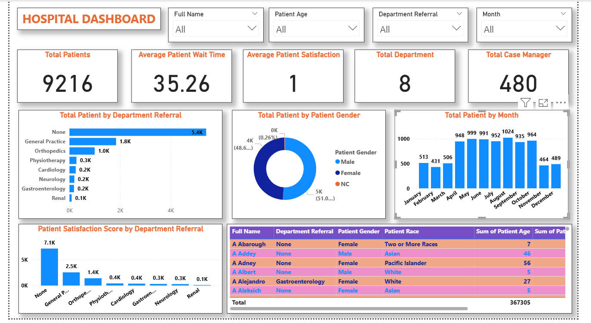

# 🏥 Hospital Dashboard

This **Hospital Dashboard** visualizes key metrics such as patient demographics, referral trends, wait times, and satisfaction scores. It helps hospital management monitor patient flow, optimize resources, and assess overall performance across departments.

---

## 📁 Project Overview

This project showcases a hospital dashboard created in **Power BI**. It includes:

- Patient demographics and referral trends
- Average wait times and satisfaction scores
- Department-wise performance metrics
- Interactive charts and slicers for detailed analysis

---

## 🔧 Tools Used

- **Microsoft Power BI Desktop**
- Data Modeling with Power Query
- DAX Measures for calculations
- Visualizations: Bar Charts, Pie Charts, Line Graphs, Tables
- Slicers for interactive filtering

---

## 📸 Preview

> Screenshot of the main dashboard view.

---

## 🚀 Getting Started

1. Clone or download this repository.
2. Open the `.pbix` file using Power BI Desktop.
3. Refresh the data model to load the latest data.
4. Use the interactive filters and visuals to explore insights across time, departments, and patient demographics.

---

